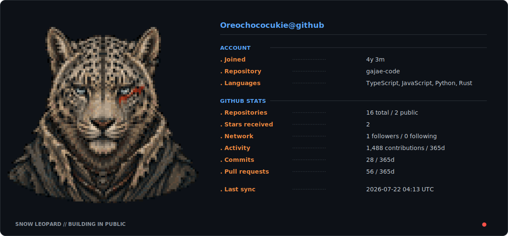

<!-- GitHub Actions regenerates both SVGs from live account data. -->
<picture>
  <source media="(prefers-color-scheme: dark)" srcset="profile-dark.svg">
  <source media="(prefers-color-scheme: light)" srcset="profile-light.svg">
  
</picture>
